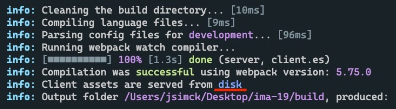
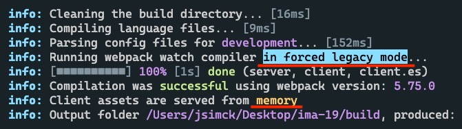

# Migration from 18.x.x to 19.0.0

While IMA.js 19 is not as big of a release as previous major version, it brings some potential breaking changes to certain API and removes some deprecated functions. We have also managed to pack some additional new features.

:::info

In addition to new features, **there have been significant updates to TypeScript types in IMA monorepo**. This should allow you to write even better applications in TypeScript, while also benefit from better autocomplete in JS applications.

:::

## Migration Guide

The list of changes required to get your app compiled is pretty minimal, however we suggest you take a look at all potential breaking changes in the (full list of changes)[migration-19.0.0.md#breaking-changes].

### `@ima/server` updates

- `@ima/server` now contains named exports, change following in `./server/app.js`

```js
// from
const imaServer = require('@ima/server')();

// to
const { createIMAServer } = require('@ima/server');
const imaServer = createIMAServer();
```

- Update definition of `$Source`, `$RevivalSettings`, `$RevivalCache`, `$Runner`, `$Styles`, `$Scripts` content variables in `spa.ejs` and DocumentView. These have been replaced by their lowerFirst counter-parts `resource` (now replaces `$Source`), `revivalSettings`, `revivalCache`, `runner`, `styles`, while `$Scripts` support have been dropped completely.
- Remove `urlParser` middleware from `app.js`, it is now part of renderApp middleware as a server hook.

### Update `@ima/react-page-renderer` import

Change `ClientPageRenderer` import from default to named import.

```js
// from
import ClientPageRenderer
  from '@ima/react-page-renderer/dist/esm/client/renderer/ClientPageRenderer';

// to
import { ClientPageRenderer }
  from '@ima/react-page-renderer/renderer/ClientPageRenderer';
```

### Register new `PageMetaHandler`

Add new `PageMetaHandler` to `PageHandlerRegistry` in `bind.js`
```js
oc.inject(PageHandlerRegistry, [PageNavigationHandler, PageMetaHandler, SspPageHandler]);
```

Optionally remove all meta tag renders from `DocumentView` and `spa.ejs` including `<title />` tag. These can be replaced with `#{meta}` content variable,

### Fire method params order change

In v18 after introducting the need for a `EventTarget` in `EventBus.fire` methods, we made a mistake with the argument order. In v19 it has been moved to first position to match other event handling methods.

```js
// from
this.fire('fetchDataArticles', event.target, { data: true })

// to
this.fire(event.target, 'fetchDataArticles', { data: true })
```

### Removed duplicates from `HttpAgent` settings:

 - `headers` have been moved to `fetchOptions`:

```js
// from
$Http: {
  defaultRequestOptions: {
    headers: {
      // Set default request headers
      Accept: 'application/json',
      'Accept-Language': config.$Language,
    },
    fetchOptions: {
      mode: 'cors',
    },
  },
}

// to
$Http: {
  defaultRequestOptions: {
    fetchOptions: {
      mode: 'cors',
      headers: {
        // Set default request headers
        Accept: 'application/json',
        'Accept-Language': config.$Language,
      },
    },
  },
}
```

## Full list of changes

## New features

### @ima/cli

 - Added support for **3rd party source maps** using `source-loader`, this is usefull especially in error overlay.
 - Added ability to customize open URL using `--openUrl` CLI argument or `IMA_CLI_OPEN_URL` environment variable. For more information see [--openUrl](../cli/cli.md#–openurl).
 - **Performance improvement** when building CSS/LESS files (except CSS modules), on `server` and `client` bundles. This can add up to 25% built speed improvement depending on the amount of CSS files your project is using.
 - Added additional CLI output information when `forcedLegacy` and `writeToDisk` options are used.
 - Fixed manifest CSS files regexp, only files from static/css/ folder are now included in final manifest.json file.
 - Added new export for `findRules`, this is simple helper function you can use to extract rules from webpack config in yor plugins for easier customization.
 - Added new export for `createWebpackConfig`, when provided with CLI args and `imaConfig`, it generates webpack configurations which are then passed to webpack compiler. This can be usefull for other tooling like StoryBook, where you need to customize different webpack config with fields from the IMA app one
 - Added additional `ImaConfigurationContext` variables: `isClientES`, `isClient` and `outputFolders`.
 - **Added support for `prepareConfigurations` CLI plugin method**, which lets you customize webpack configuration contexts, before generating webpack config from them.
- **Added new `cssBrowsersTarget` ima.config.js settings**, this allows you to easily customize postcss-preset-env browsers targets field.

<div class="text--center">



</div>
<div class="text--center">



</div>

### @ima/plugin-cli
 - **Added support for source-maps**, now all files transformed using `swc` (JS/TS) also produce `.map` files alongside transformed files.
 - Added ability to enable/disable source maps generation using `sourceMaps` option in `ima-plugin.config.js` configuration file.
 - Added ability to add new custom transformers using `transformers` option in` ima-plugin.config.js` configuration file.
 - When parsing configuration file the plugin now searches for `ima-plugin.config.js` files recursively up to filesystem root. This allows to have one custom config file for monorepositories and removes the need of duplicating same config across all package directories.

### @ima/hmr-client
 - Fixed async issue in HMR, where IMA app could be re-rendered before the old instance finished cleanup.

### @ima/core
 - Added new `CancelError` used for canceling running route handlers.
 - Fix window history for error action, error pages are now not added to window history.
 - Package source files now include source map files.
 - Added `RouterEvents.BEFORE_LOADING_ASYNC_ROUTE` and `RouterEvents.AFTER_LOADING_ASYNC_ROUTE` dispatcher events, which you can use to implement custom loaders when routing between async routes (or use it for any other handling).
 - All exports now use **named exports** (this is technically only package-wide change and does not mean nothing for the end user).
 - Added multiple new **TS types**, while also fixing existing types. Since rewriting IMA.js to typescript has been huge task, there may still be some type inconsistencies which we will try to fix in following releases to further improve TS experience in IMA.js ecosystem.
 - Added new `onRun` event to `window.$IMA.Runner`.
 - Add new methods `isClientError()` and `isRedirection()` to `GenericError`.
 - `getRouteHandlersByPath()` method on `AbstractRouter` is now public. This return's middlewares and route for given path.
 - Fixed HttpAgent types -> data in method arguments should be optional
 - Fixed missing transaction cleanup in PageStateManager
 - Fix missing optional parameters in static router that were evaluated as undefined instead of 'undefined'.
 - Added autocompletion support for language file keys in localization functions. To be able to use this function, update `jsconfig.json`/`tsconfig.json` according to the documentation (adding `./build/tmp/types/**/*"` path to `include` field should suffice).
 - Controller and Extension event bus methods can be targeted with prefix. Prefix is set by static field in controller/extension class e.g. `$name = 'ArticleController'`;. Event is then `ArticleController.eventName`:

```javascript title="./app/page/article/ArticleController.js"
class ArticleController {
  static $name = 'ArticleController';

  onExpand({ expandableId }) {
    console.log(expandableId);
  }
}
```

```javascript title="./app/component/expandable/ExpandLink.jsx"
function ExpandLink() {
  onClick(event) {
    const { expandableId } = this.props;
    this.fire('ArticleController.expand', { expandableId });
  }
}
```

#### Router changes
 - Added middleware execution timeout => all middlewares must execute within this defined timeframe (defaults to 30s). This can be customized using `$Router.middlewareTimeout` app settings.
 - Router middlewares now support `next` callback, which when defined, has to be called, otherwise the middleware will eventually timeout and not proceed any further. This enables some additional features, where you are able to stop route processing by not calling the `next` function if desired.
 - **Middlewares can now return object value**, which will be merged to the locals object, received as a second argument in middleware function. Middlewares wich `next` callback function can "return" additional locals by calling `next` with an argument.

```js
router.use(async (params, locals, next) => {
  next({ counter: counter++ });
});
```

 - For more information about middlewares see [middlewares section](../basic-features/routing/middlewares.md).

### @ima/react-page-renderer
 - Package source files now include source map files.
 - Fixed once hook parametr type.
 - Moved meta tags management to new PageMetaHandler, see [Seo and Meta Manager](../basic-features/seo-and-meta-manager.md) section for new updates to meta manager.
 - IMA specific React hooks have been rewritten to **TypeScript**.
 - Added package exports of multiple missing TS types and other interfaces (this provides better support for writing your applications in TS).

### @ima/error-overlay
 - Fixed an issue where invalid Error params caused circular dependency error.
 - Fixed an issue where errors, that occurred before error overlay is initialized were not reported to the error overlay.
 - Reduced number of levels that are expanded by default in error overlay error params view.
 - Added ability to hide/show error params, this settings is saved to local storage.

### @ima/server
 - Style content variable now automatically generates preload links for app styles.
 - Added new metric - **concurrent requests** to monitoring.
 - Add information about error cause in places, where we used to throw away this information.
 - Add routeName key to res.locals instead of res.$IMA, since res.$IMA should not be used anymore.
 - Added `X-Request-ID` to revival settings. Can be accessed through `$IMA.$RequestID`. This can be usefull to match same requests between client and server instances.
 - Added **XSS protection** to **host** and **protocol** in revival settings.
 - Add support for Client Errors and Redirects when serving static error pages.
 - Added option to **force app host** and **protocol**, using `$Server.host` and `$Server.protocol` settings in the `environment.js`. (These 2 values can also be functions).
 - The App error route is protected for exceeding static thresholds.
 - The Emitter `event.cause` is removed. The error cause is set in `event.error.cause`.
 - Fixed issue with dummyApp forcing 'en' language, which fails to resolve on applications with different language settings.
 - Fixed issue where server redirect showed ErrorOverlay in debug mode.
 - The instances of `$Dispatcher`, `$Cache`, `$PageRenderer` and `$PageManager` are cleared after server sending response. Clearing PageManager cause calling `destroy` lifecycle method of controller and extensions on server.
 - Add option to use custom `manifestRequire`.
 - SPA blacklist config is omitted for using degradation isSPA method when decision serving SPA page.

### create-ima-app
 - Added new **typescript template**, use `--typescript` option when generating new application.
 - Migrated from default to named exports.
 - Fixed default static path and public path settings.
 - Updated environment.js and settings.js to support new IMA19 features.

## Breaking Changes

### @ima/cli
 - Removed `isESVersion` `ImaConfigurationContext` variable (use `isClientES` instead).

### @ima/core
 - `AbstractRouter.manage` method no longer has controller and view properties in an object argument.
 - Multiple changes in router route handling and page manager with a goal of implementing ability to cancel running handlers before handling a new ones. This results in much more stable routing specifically when using async routes. Each route should now be executed "**sequentially**" where BEFORE/AFTER_HANDLE_ROUTE router events should always fire in correct order. Also if you quickly move between different routes, without them finishing loading, the page manager is able to cancel it's executing mid handling and continue with a new route, which results in faster and more stable routing. While this change is essentially not a breaking change, since it only changes our internal API, it could possibly result in some new behavior.
 - Removed `ExtensibleError`.
 - `StatusCode` has been renamed to `HttpStatusCode`.
 - `$Source` environment.js variable has been renamed to `$Resources`.
 - Removed deprecated package **entry points**, this includes all imports directly referencing files from `./dist/` directory. Please update your imports to the new [exports fields](https://github.com/seznam/ima/blob/master/packages/core/package.json#L39).
 - `extractParameters()` function in `DynamicRoute` now receives additional object argument, containing `query` and `path` (not modified path) for more control over extracted parameters. **The router now uses params returned from `extractParameters()` directly**. It no longer automatically merges query params into the resulting object. If you want to preserve this behavior, merge the extracted route params with query object provided in the second argument.

#### Router changes
 - Replace custom URL parsing methods in `AbstractRoute`, `StaticRoute` and `DynamicRoute` with combination of native `URL` and `URLSearchParams`.
 - Removed `pairsToQuery`, `paramsToQuery`, `getQuery`, `decodeURIParameter` static methods on `AbstractRoute`. These have been replaced with combination of native `URL` and `URLSearchParams` interfaces.
 - `getTrimmedPath` static method in `AbstractRoute` is now instance method.
 - Url query params with no value (`?param=`) are no longer extracted as `{ param: true }`, but as `{ param: '' }`. Please update your code to check for `key` presence in these cases rather than `true` value.
 - Parsing of semi-colons inside query params is not supported (as a result of using `URLSearchParams`)

#### HttpAgent changes
 - `IMA HttpAgent` now removes by default all headers from request and response which is stored in Cache. You can turn off this behavior with `keepSensitiveHeaders` option but **it is not recommended**.
 - Removed support for HttpAgent options.listener (these were used mainly in plugin-xhr, which is now unsupported)
 - You can now define multiple `postProcessors[]` in `HttpAgent` options. This replaces old `postProcessor` option, if you are using any post processor you need to update your options to postProcessors and make sure to wrap this post processor in an array.
 - Remove older, conflicting settings of `HttpAgent`, `withCredentials`, `headers`, and `listeners`. The first two now conflict with the newer `options.fetchOptions`, the last one (`listeners`) has been removed completely. `options.withCredentials` and `options.headers` are no longer followed. Use `options.fetchOptions.credentials` and `options.fetchOptions.headers` instead. For definition, see the native Fetch API (note: for simplicity, `options.fetchOptions.headers` only accepts headers defined by an object, not a tuple or an instance of Headers).

#### MetaManager changes
 - Rewritten meta tag management in SPA mode, **all MetaManager managed tags are removed between pages while new page contains only those currently defined using setMetaParams function in app controller**. This should make meta tags rendering more deterministic, while fixing situations where old meta tags might be left on the page indefinitely if not cleaner properly.
 - MetaManager getters now always return object with key=value pairs of their set value. This should make settings additional meta attributes in loops much easier (for example: `getMetaProperty('og:title'); -> { property: 'property-value' });`)
 - Meta values/attributes with null/undefined values are not rendered, other values are converted to string.
 - Added new **iterator functions** to MetaManager.

```js
this.#metaManager.getMetaNamesIterator();
this.#metaManager.getMetaPropertiesIterator();
this.#metaManager.getLinksIterator();
```

 - Added ability to set **additional attributes** for meta tags/links in meta manager:

```js
this.#metaManager.setLink('lcp-image', media.url, {
  'lcp-image-imagesizes': media.sizes,
  'lcp-image-imagesrcset': media.srcSet
});
```

### @ima/react-page-renderer
 - Removed deprecated package **entry points**, this includes all imports directly referencing files from `./dist/` directory. Please update your imports to the new [exports fields](https://github.com/seznam/ima/blob/master/packages/react-page-renderer/package.json#L23).
 - `isSSR` hook has been removed, use `window.isClient()` directly from `useComponentUtils()`.
 - `useSettings` now returns `undefined`, when settings is not found when using `selector` namespace as an argument.
 - All exports are now **named exports**, you need to update import to `ClientPageRenderer` in bind.js to:
 - Changed signature of `useWindowEvent` hook, it now matches bindEventListener parameters of ima window.

```javascript title=./app/config/bind.js
import { ClientPageRenderer } from '@ima/react-page-renderer/renderer/ClientPageRenderer';
```

 - Change order of method arguments in Component `fire` method. `target` has been moved to the first argument position.

```js
// from
this.fire('fetchDataArticles', event.target, { data: true })

// to
this.fire(event.target, 'fetchDataArticles', { data: true })
```

### @ima/dev-utils
 - Package now uses `exports` fields, instead of `./dist/*` imports. [See package.json](https://github.com/seznam/ima/blob/master/packages/dev-utils/package.json#L20).

### @ima/server
 - Update @esmj/monitor to 0.5.0 with breaking change for returns value from subscribe method where returns subscription is object with unsubscribe method.
 - Migrated urlParser middleware to ima server BeforeRequest hook. Remove `urlParser` middleware from `app.js`, it is now part of `renderApp` middleware.
 - Dropped support for direct `response.contentVariables` mutations, use `event.result` and return values in `CreateContentVariables` event.
 - Dropped support for `$Source`, `$RevivalSettings`, `$RevivalCache`, `$Runner`, `$Styles`, `$Scripts` content variables. These have been replaced by their lowerFirst counter-parts `resource` (now replaces `$Source`), `revivalSettings`, `revivalCache`, `runner`, `styles`, while `$Scripts` support have been dropped completely.
 - Default resources in `$Resources` now produce `styles` and `esStyles` fields (should not break anything in 99% of the applications). This does not necessarily mean which should be loaded on which `es` version, but what bundle produced those styles. This also means that without any custom configuration, all styles should now be under `esStyles` key, since they are built in client.es webpack bundle. This change was made to enable built of 2 CSS bundles simliar to how we handle ES bundles. This can be enabled using `@ima/cli-plugin-legacy-css`.
 - The package now provides multiple additional exports using named exports, the deafult export has been replaced with named `createIMAServer` function.
